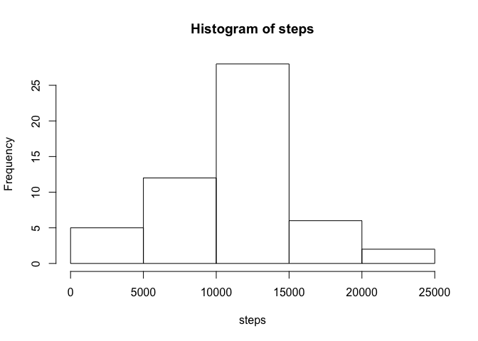
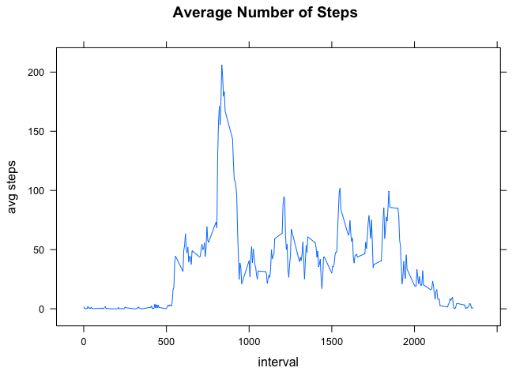
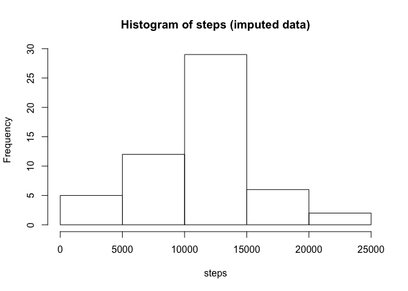
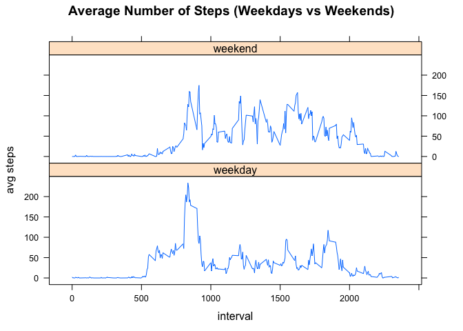

# Reproducible Research: Peer Assessment 1


## Loading and preprocessing the data

```r
dat <- read.csv('activity.csv')
dat$date <- as.Date(dat$date, "%Y-%m-%d")
```

## What is mean total number of steps taken per day?

```r
steps <- tapply(dat$steps, dat$date, sum)
hist(steps)
```

 

```r
meanSteps <- mean(steps, na.rm=TRUE)
medianSteps <- median(steps, na.rm=TRUE)
cat('The mean number of steps taken is: ', meanSteps)
```

```
## The mean number of steps taken is:  10766.19
```

```r
cat('The median number of steps taken is: ', medianSteps)
```

```
## The median number of steps taken is:  10765
```

## What is the average daily activity pattern?

```r
avgSteps <- aggregate(dat$steps, list(time=dat$interval), mean, na.rm=TRUE)
library(lattice)
xyplot(x~time, data = avgSteps, type="l",xlab = "interval", ylab = "avg steps", main = "Average Number of Steps")
```

 

```r
maxInterval <- avgSteps[which.max(avgSteps$x),'time']
cat('The interval in which the maximum average numbers of steps is taken is: ', maxInterval)
```

```
## The interval in which the maximum average numbers of steps is taken is:  835
```

## Imputing missing values

```r
numMissing <- nrow(dat[is.na(dat$steps),])
cat('The number of missing values is: ', numMissing)
```

```
## The number of missing values is:  2304
```

We will replace missing values with the average value for that interval, averaged over all dates. We then recompute the histogram, mean, and median.

```r
dat2 <- dat
dat2[is.na(dat2$steps),'steps'] <- avgSteps[which(avgSteps$time == dat2[is.na(dat2$steps),'interval']),'x']
steps2 <- tapply(dat2$steps, dat$date, sum)
hist(steps2, main = "Histogram of steps (imputed data)", xlab = "steps")
```

 

```r
meanSteps2 <- mean(steps2, na.rm=TRUE)
medianSteps2 <- median(steps2, na.rm=TRUE)
cat('The mean number of steps taken is: ', meanSteps2)
```

```
## The mean number of steps taken is:  10766.19
```

```r
cat('The median number of steps taken is: ', medianSteps2)
```

```
## The median number of steps taken is:  10765.59
```


## Are there differences in activity patterns between weekdays and weekends?


```r
dat2$isWeekday <- factor(weekdays(dat2$date)%in%c('Saturday','Sunday'), labels=c('weekday','weekend'))
wkdayAvgSteps <- aggregate(dat2$steps, list(time=dat2$interval, isWeekday = dat2$isWeekday), mean, na.rm=TRUE)

xyplot(x ~ time | isWeekday, data = wkdayAvgSteps, layout = c(1,2), type = "l", xlab = "interval", ylab = "avg steps", main = "Average Number of Steps (Weekdays vs Weekends)")
```

 
